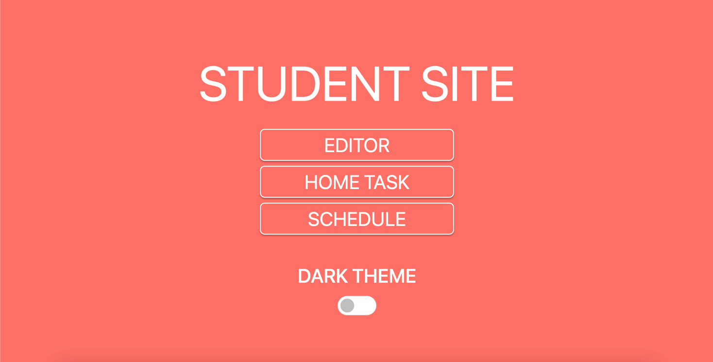
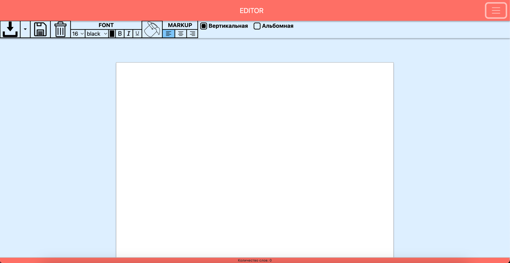
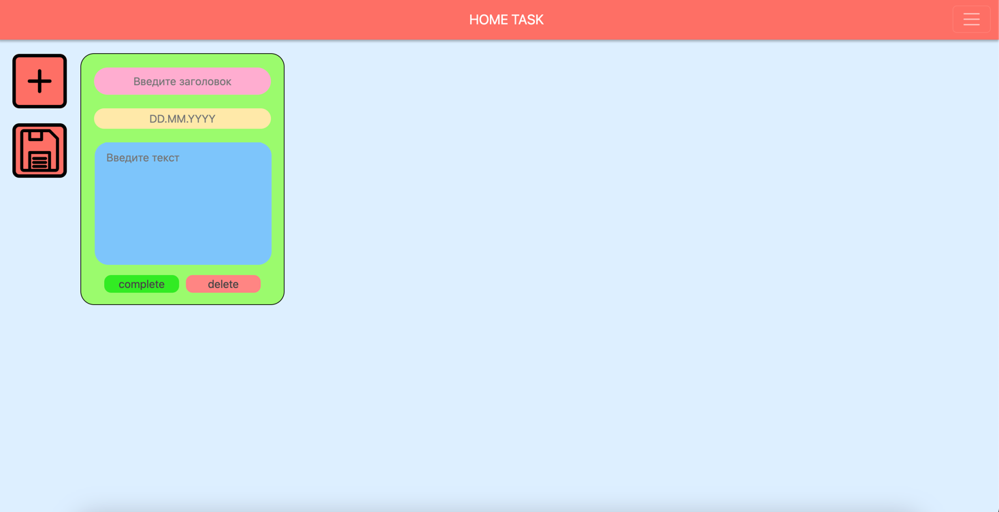
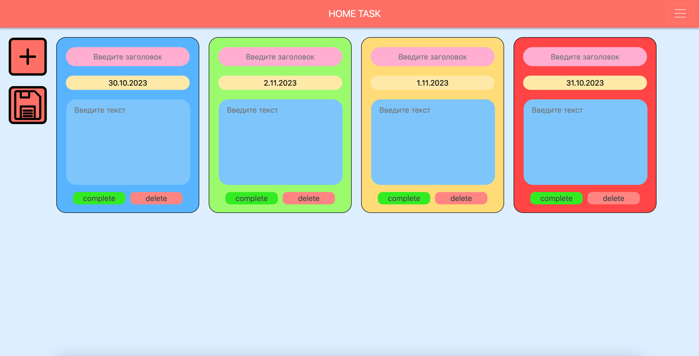
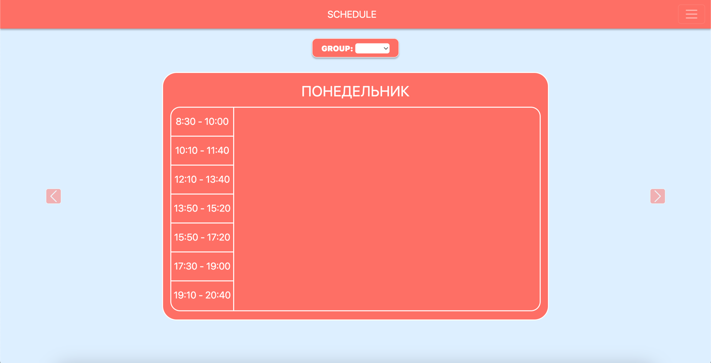
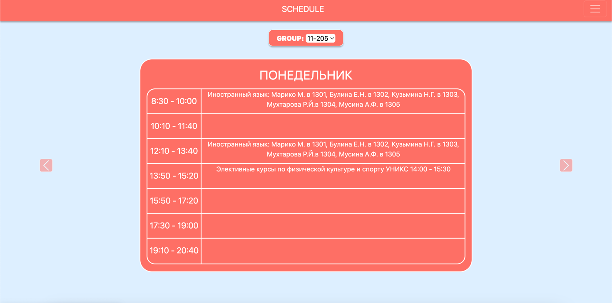
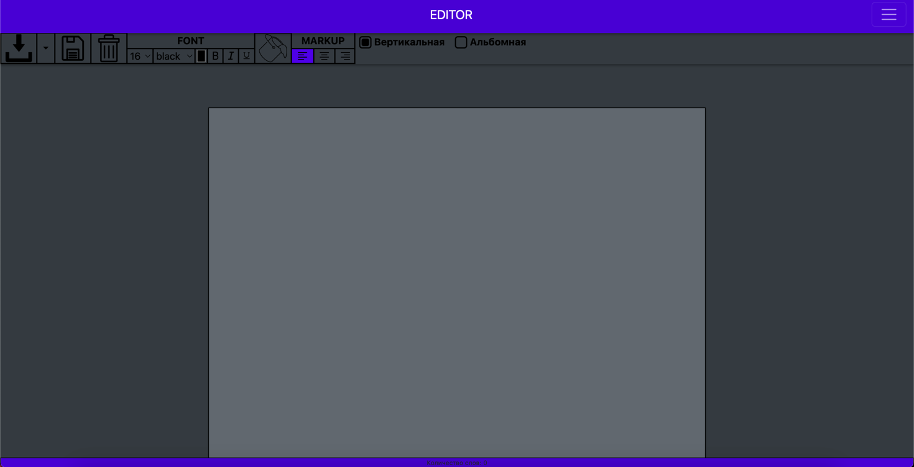
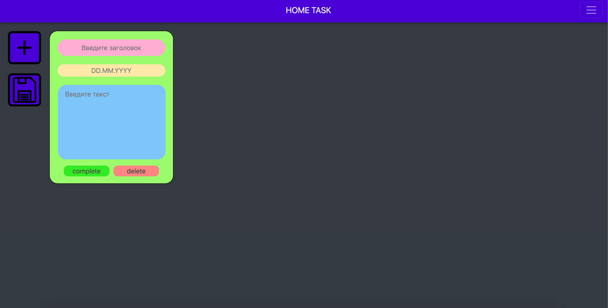
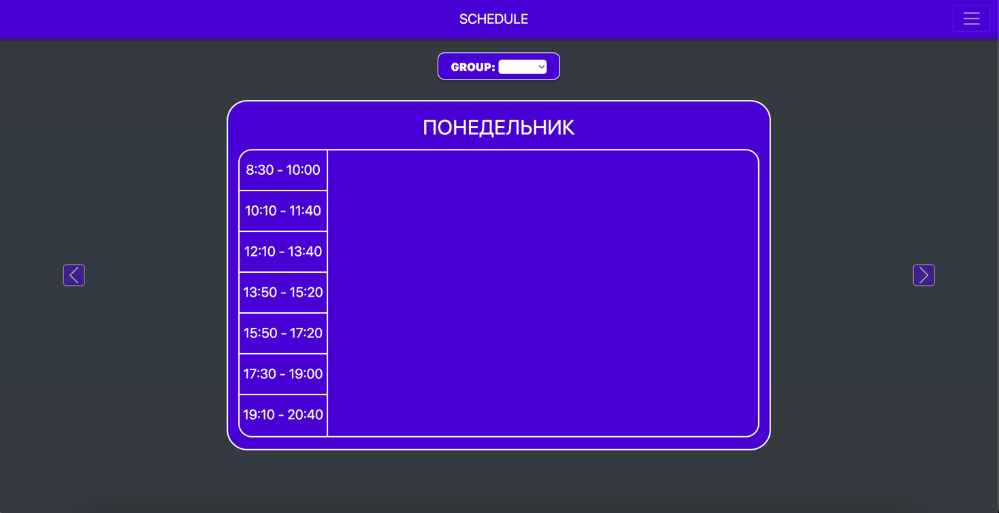

<h1 align="center">Student site</h1>
<h2 align="center">Что это такое?</h2>

 Это веб-приложение, в котором вы можете писать и редактировать текст, записывать свое домашнее задание и смотреть свое учебное расписание! 

<h2 align="center">Функционал</h2>
<h3 align="center">Editor</h3>
 

В нем вы можете редактировать написанный текст. Например, изменить его размер и цвет, а также многое другое.  Весь интерфейс приложения лаконичен и понятен, что делает использование приложения максимально комфортным.
. После завершения работы, вы можете сохранить его себе на устройство в двух форматах:
- .pdf
- .txt

Если вы нажмете на иконку "сохранить", то ваш написанный текст и все его стилистические настройки сохранятся, и при обновлении страницы в браузере ничего не пропадет

<h3 align="center">Home task</h3>
 

Во вкладке "HOME TASK" нас встречает простой и понятный интерфейс. Чтобы добавить свое новое домашнее задание, нужно нажать на кнопку с плюсом, у нас появится окошко зеленого цвета.
Розовый блок предназначен для записи названия вашего предмета, желтый - для установления срока сдачи, а в синем - суть задания.

В зависимости от срока сдачи, окошко окрашивается в разные цвета, а если вы выполнили задание, то можете нажать на кнопку "complete" и окошко окрасится в синий цвет (Дата на момент публикации: 31.10.2023): 

<h3 align="center">Schedule</h3>
 

В последней вкладке "SCHEDULE", если вы студент 11-20X группы, то вы можете посмотреть свое расписание занятий, просто выбрав нужную вам группу

<h3 align="center">Дополнительно</h3>

Также, вы можете включить темную тему, нажав на ползунок на начальном экране, либо во вкладке справа

    
    
    

